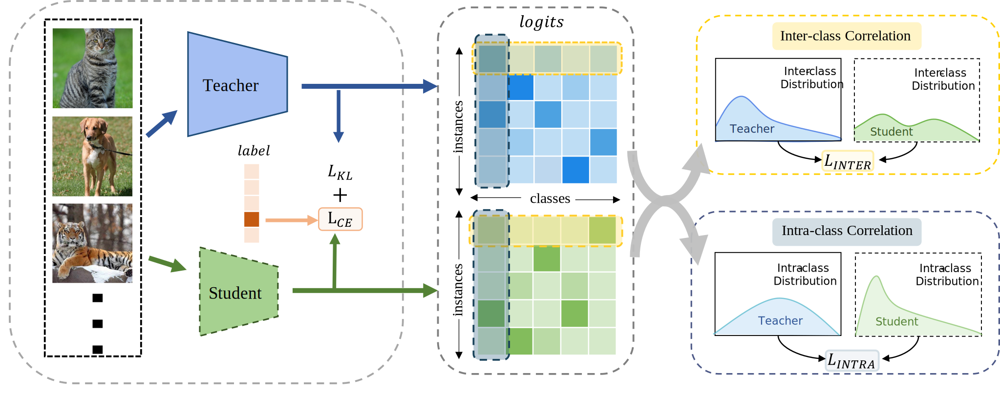

<div align=center><div align=left>

This repo is

(1) a PyTorch library that provides classical knowledge distillation algorithms on mainstream CV benchmarks,

(2) forked from [DKD](https://github.com/megvii-research/mdistiller)


# Monotonic Rank Distillation: Leveraging Kendall Correlation for Model Compression

### Framework & Performance

<div align=center><div align=left>

### Main Benchmark Results

On CIFAR-100:


| Teacher <br> Student | ResNet56 <br> ResNet20 | ResNet110 <br> ResNet32 | ResNet32x4 <br> ResNet8x4 | WRN-40-2 <br> WRN-16-2 | WRN-40-2 <br> WRN-40-1 | VGG13 <br> VGG8 |
| :------------------: | :--------------------: | :---------------------: | :-----------------------: | :--------------------: | :--------------------: | :-------------: |
|          KD          |         70.66          |          73.08          |           73.33           |         74.92          |         73.54          |      72.98      |
|       **Ours**       |       **71.80**        |        **73.70**        |         **77.46**         |       **76.32**        |       **74.96**        |    **74.51**    |


| Teacher <br> Student | ResNet32x4 <br> ShuffleNet-V1 | WRN-40-2 <br> ShuffleNet-V1 | VGG13 <br> MobileNet-V2 | ResNet50 <br> MobileNet-V2 | ResNet32x4 <br> ShuffleNet-V2 |
| :------------------: | :---------------------------: | :-------------------------: | :---------------------: | :------------------------: | :---------------------------: |
|          KD          |             74.07             |            74.83            |          67.37          |           67.35            |             74.45             |
|       **Ours**       |           **77.18**           |          **76.42**          |        **70.24**        |         **70.54**          |           **78.13**           |


On ImageNet:

| Teacher <br> Student | ResNet34 <br> ResNet18 | ResNet50 <br> MobileNet-V1 |
| :------------------: | :--------------------: | :------------------------: |
|          KD          |         70.66          |           68.58            |
|       **Ours**       |       **72.31**        |         **73.15**          |

# MDistiller


### Installation

Environments:

- Python 3.6
- PyTorch 1.9.0
- torchvision 0.10.0

Install the package:

```
pip3 install -r requirements.txt
pip install -e .
```

### Getting started

0. Wandb as the logger

- The registeration: <https://wandb.ai/home>.
- If you don't want wandb as your logger, set `CFG.LOG.WANDB` as `False` at `mdistiller/engine/cfg.py`.

1. Evaluation

- If test the models on ImageNet, please download the dataset at <https://image-net.org/> and put them to `./data/imagenet`

  ```bash
  # evaluate teachers
  python3 tools/eval.py -m resnet32x4 # resnet32x4 on cifar100
  python3 tools/eval.py -m ResNet34 -d imagenet # ResNet34 on imagenet
  
  # evaluate students
  python3 tools/eval.p -m resnet8x4 -c download_ckpts/kendall_resnet8x4 # mrkd-resnet8x4 on cifar100
  python3 tools/eval.p -m model_name -c output/your_exp/student_best # your checkpoints
  ```


2. Training on CIFAR-100


  ```bash
  # for instance, our method.
  python3 tools/train.py --cfg configs/cifar100/kendall/res32x4_res8x4.yaml
  
  # you can also change settings at command line
  python3 tools/train.py --cfg configs/cifar100/kendall/res32x4_res8x4.yaml SOLVER.BATCH_SIZE 128 SOLVER.LR 0.1
  ```

3. Training on ImageNet

- Download the dataset at <https://image-net.org/> and put them to `./data/imagenet`

  ```bash
  # for instance, our method.
  python3 tools/train.py --cfg configs/imagenet/kendall/r34_r18.yaml
  ```

4. Extension: Visualizations

- Jupyter notebooks: [tsne](tools/visualizations/tsne.ipynb) and [correlation_matrices](tools/visualizations/correlation.ipynb)


### Custom Distillation Method

1. create a python file at `mdistiller/distillers/` and define the distiller

  ```python
  from ._base import Distiller

  class MyDistiller(Distiller):
      def __init__(self, student, teacher, cfg):
          super(MyDistiller, self).__init__(student, teacher)
          self.hyper1 = cfg.MyDistiller.hyper1
          ...

      def forward_train(self, image, target, **kwargs):
          # return the output logits and a Dict of losses
          ...
      # rewrite the get_learnable_parameters function if there are more nn modules for distillation.
      # rewrite the get_extra_parameters if you want to obtain the extra cost.
    ...
  ```

2. regist the distiller in `distiller_dict` at `mdistiller/distillers/__init__.py`

3. regist the corresponding hyper-parameters at `mdistiller/engines/cfg.py`

4. create a new config file and test it.

# License

MDistiller is released under the MIT license. See [LICENSE](LICENSE) for details.

